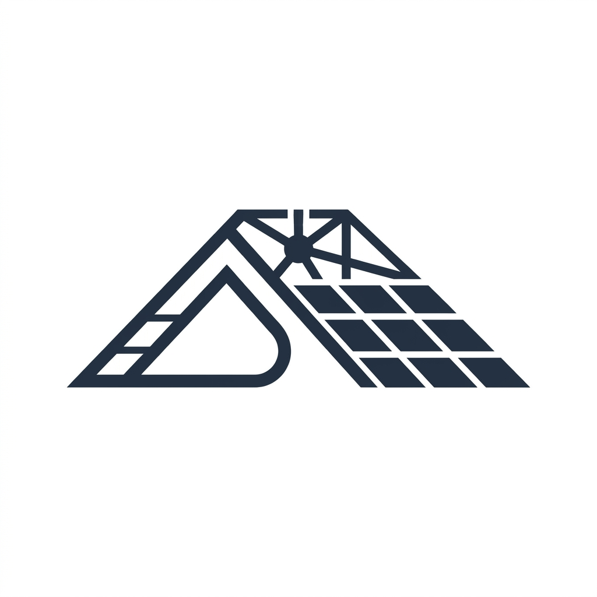

<div align="center">
  
  <h1 align="center">☀️ Solar Roof AI Planner</h1>
  <p align="center">
    <strong>An interactive solar planning workspace for rooftop mapping, AI-assisted roof detection, panel layout simulation, and financial estimation.</strong>
  </p>

  <p align="center">
    <a href="https://react.dev/"></a>
    <a href="https://vitejs.dev/"></a>
    <a href="https://www.typescriptlang.org/"></a>
    <a href="https://tailwindcss.com/"></a>
    <a href="https://roboflow.com/"></a>
    <a href="https://creativecommons.org/licenses/by/4.0/"></a>
  </p>
</div>

---

## 💡 Why This Project Exists

Solar feasibility tools are often fragmented across GIS software, internal spreadsheets, and engineering workflows. This project demonstrates how a single app can guide users from location discovery to actionable planning output, while keeping AI suggestions reviewable and editable.

This is not just a detection demo. It's a complete product-style workflow that balances:

- ✨ **Interactive map UX**
- 🤖 **Assistive computer vision**
- 📐 **Geospatial calculations**
- 💰 **Planning and financial context**

---

## 📸 See It In Action

| Workspace Overview | Blueprint | PDF Report |
| :---: | :---: | :---: |
|  |  |  |

---

## ⚡ Core Features

### 1️⃣ Property Search & Mapping
- **Address & Place Search:** Fast rooftop lookup.
- **Map-first Workspace:** Centered automatically on the selected property.
- **Satellite Analysis Flow:** Visual roof clarity with high-res imagery.

### 2️⃣ Roof & Obstacle Mapping Tools
- **Manual Drawing:** Interactive map editing tools.
- **Separate Layers:** Editable layers for roof polygons and obstacles.
- **Complex Geometries:** Support for irregular shapes and exclusion zones.

### 3️⃣ AI-Assisted Roof Detection
- **Direct Integration:** Send snapshots directly to Roboflow hosted workflows for analysis.
- **Plane & Obstacle Detection:** Identify roof structures directly from imagery.
- **Review & Apply:** Preview detections before applying to the workspace. Tune confidence and area filters.

### 4️⃣ Geospatial & Solar Analysis
- **Metrics Computation:** Calculate gross area, blocked area, and net usable area.
- **Orientation Estimation:** AI-driven orientation candidates.
- **Solar Exposure Heatmap:** Overlay visual zones showing stronger and weaker exposure areas based on sun position and context.

### 5️⃣ Panel Layout Simulation
- **Manual & Auto-pack Placement:** Fine-grained manual control or automatic maximization.
- **Capacity-Aware Selection:** Select panel types with real-time capacity counting.
- **Validation:** Prevent overlaps and invalid placements using worker-based operations for responsive UI.

### 6️⃣ Financial Planning & Export
- **Financial Dashboard:** Sizing inputs, planning assumptions, and real-time estimation charts.
- **Export Options:** GeoJSON export of roof/obstacle geometry.
- **Reporting:** Generate blueprint-style PDF reports for planning handoffs.

---

## 🎯 End-to-End User Flow

1. 🔍 **Search** for a property.
2. 🗺️ **Enter** the map workspace and switch to imagery mode.
3. 🏗️ **Draw** roof and obstacles manually, or run **auto-detection**.
4. ✅ **Review** detection results and accept only what looks correct.
5. 📊 **Calculate** usable roof area and inspect solar heatmap hints.
6. 📦 **Simulate** panel placement manually or with auto-pack.
7. 💵 **Review** estimated system capacity and financial outcomes.
8. 📤 **Export** geometry/report artifacts.

---

## 🏗️ Architecture

### Frontend (React 18 + Vite + TypeScript)
- 🗺️ **Interactive mapping** and draw/edit UX (Leaflet, Turf.js)
- 🔎 **Address search** integration (OpenStreetMap Nominatim)
- ⚙️ **Panel layout logic** and worker offloading
- ☀️ **Solar heatmap** visualization
- 💰 **Financial dashboard** components (Recharts)

### Hosted Detection (Roboflow Workflow)
- ☁️ **Serverless workflow** called directly from the browser (`POST https://serverless.roboflow.com/<workspace>/workflows/<workflow_id>`)
- 🧾 **Structured output parsing** from `svg_output` and `json_output`
- 📋 **Metadata shaping** into app-compatible roof/obstacle results

---

## 🚀 Getting Started

### Prerequisites
- **Node.js** 20+

### Installation & Execution

1. **Install dependencies:**
   ```bash
   npm install --workspace frontend
   ```

2. **Set up Environment Variables:**
   Create a `.env` file in the `frontend` directory with the following variables:
   ```env
   VITE_ROBOFLOW_API_URL=https://serverless.roboflow.com
   VITE_ROBOFLOW_WORKSPACE=rooflayout
   VITE_ROBOFLOW_WORKFLOW_ID=detect-count-and-visualize
   VITE_ROBOFLOW_API_KEY=your_api_key_here
   ```

3. **Run the development server:**
   ```bash
   npm run frontend:dev
   ```

   The app will be available at **http://localhost:5173**.

---

## ⚠️ Limitations and Assumptions
- 🖼️ Detection quality heavily depends on imagery quality, zoom level, and roof contrast.
- 📐 Pitch, aspect, and height values are estimation-grade derived from 2D imagery.
- 🎯 Results are intended for **planning and pre-sales exploration**, not permit-ready engineering.
- ✏️ Manual edits remain essential for complex edge cases.

---

## 🔮 Roadmap
- [ ] Stronger model-based detection beyond classical CV heuristics.
- [ ] More explicit setback and code-rule constraints for panel placement.
- [ ] Time-series irradiance simulation and seasonal production profiles.
- [ ] Authentication, saved projects, and collaboration workflows.

---

## 🤝 Contributing
Contributions, issues, and feature requests are welcome! 
Feel free to check [issues page](#) if you want to contribute.

---

## 📄 License
This project is licensed under the [Creative Commons Attribution 4.0 International (CC BY 4.0)](https://creativecommons.org/licenses/by/4.0/) License.
